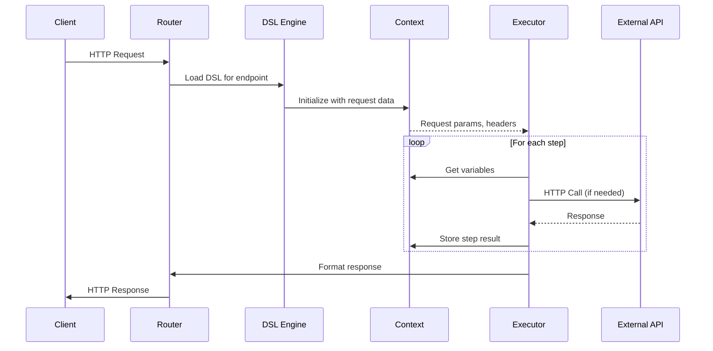
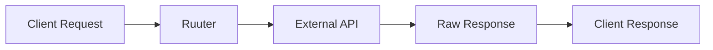
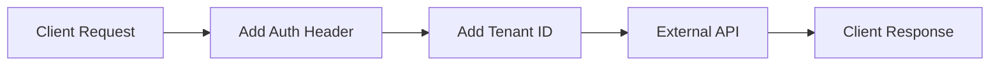
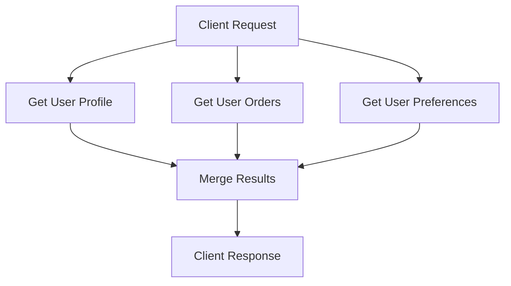
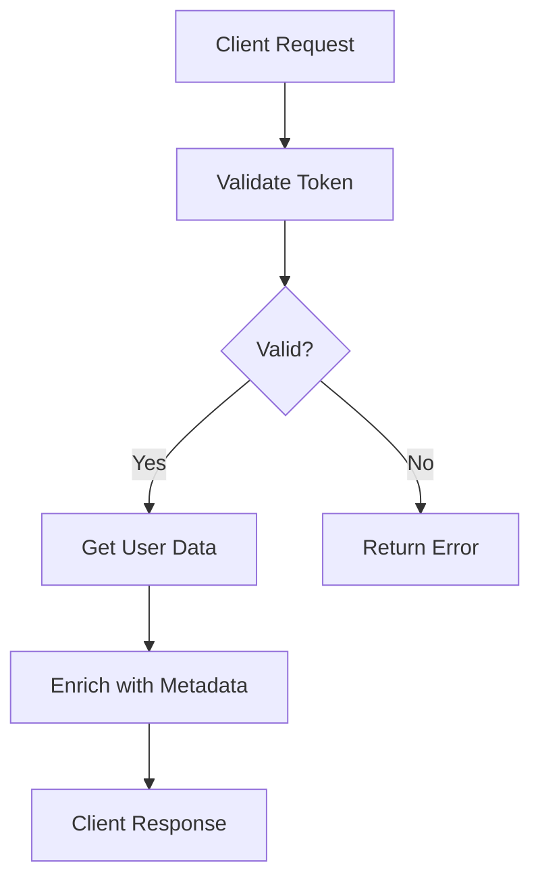
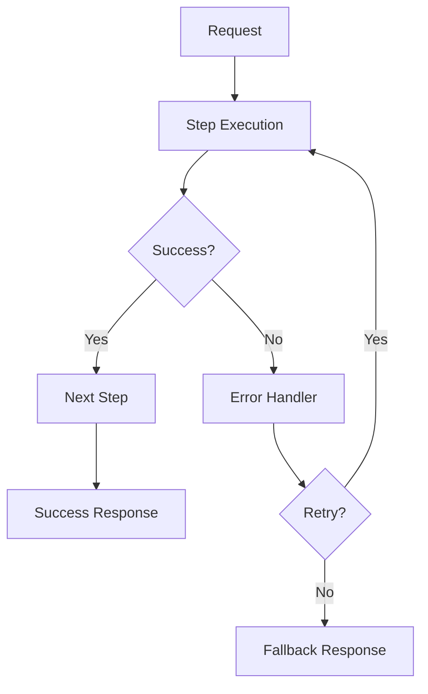
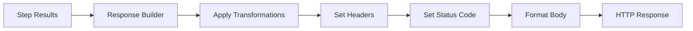

# Data Flow Architecture

## Overview

This document describes how data flows through Ruuter from initial HTTP request to final response, including transformations, storage, and service interactions.

## Request Data Flow



## Data Sources

### 1. Request Data

Data can originate from multiple parts of the HTTP request:

- **URL Parameters**: `GET /users?id=123`
- **Path Variables**: `GET /users/123/profile`
- **Request Body**: JSON, form data, or raw content
- **Headers**: Authorization, Content-Type, custom headers
- **Cookies**: Session tokens, preferences

### 2. Configuration Data

- **Constants**: Loaded from `constants.ini`
- **Environment Variables**: System-level configuration
- **DSL Variables**: Defined within YAML files

### 3. Step Results

Each step's output becomes available for subsequent steps:

```yaml
step1:
  call:
    url: "http://api/users/${request.params.id}"

step2:
  call:
    url: "http://api/orders"
    body:
      userId: "${step1.result.id}"
```

## Data Flow Patterns

### Pattern 1: Simple Pass-Through



Example DSL:
```yaml
response:
  call:
    url: "http://backend/api/data"
    method: GET
```

### Pattern 2: Request Enrichment



Example DSL:
```yaml
call:
  url: "http://backend/api/data"
  method: POST
  headers:
    Authorization: "Bearer ${constants.api_token}"
    X-Tenant-ID: "${request.headers.tenant}"
  body: "${request.body}"
```

### Pattern 3: Multi-Service Aggregation



Example DSL:
```yaml
profile:
  call:
    url: "http://users/api/profile/${request.params.id}"

orders:
  call:
    url: "http://orders/api/user/${request.params.id}"

preferences:
  call:
    url: "http://prefs/api/user/${request.params.id}"

response:
  body:
    user: "${profile.result}"
    orders: "${orders.result}"
    preferences: "${preferences.result}"
```

### Pattern 4: Sequential Processing



Example DSL:
```yaml
validateToken:
  call:
    url: "http://auth/validate"
    headers:
      Authorization: "${request.headers.authorization}"

getUserData:
  condition: "${validateToken.status == 200}"
  call:
    url: "http://users/api/${validateToken.result.userId}"

response:
  condition: "${validateToken.status == 200}"
  body: "${getUserData.result}"
  status: 200

errorResponse:
  condition: "${validateToken.status != 200}"
  body:
    error: "Unauthorized"
  status: 401
```

## Context Data Model

The execution context stores all data accessible during request processing:

```yaml
context:
  request:
    method: "POST"
    path: "/api/users"
    params:
      id: "123"
    headers:
      authorization: "Bearer xyz..."
    body:
      name: "John"

  constants:
    api_url: "http://backend"
    timeout: 5000

  steps:
    step1:
      result: {...}
      status: 200
    step2:
      result: {...}
      status: 200
```

## Data Transformation

### Variable Substitution

Ruuter uses `${...}` syntax for variable substitution:

```yaml
call:
  url: "${constants.base_url}/users/${request.params.id}"
  headers:
    Authorization: "Bearer ${constants.token}"
  body:
    name: "${request.body.name}"
    email: "${request.body.email}"
```

### JSON Path Extraction

Access nested data using dot notation:

```yaml
response:
  body:
    userId: "${getUserProfile.result.data.user.id}"
    userName: "${getUserProfile.result.data.user.name}"
```

### Data Mapping

Transform response structures:

```yaml
transformData:
  map:
    id: "${sourceData.result.userId}"
    fullName: "${sourceData.result.firstName} ${sourceData.result.lastName}"
    email: "${sourceData.result.emailAddress}"
```

## Error Data Flow



Example with error handling:

```yaml
mainCall:
  call:
    url: "http://api/data"
    retry: 3
    on_error: fallback

fallback:
  response:
    body:
      error: "${mainCall.error.message}"
      fallback: true
    status: 503
```

## Response Data Flow



## Performance Considerations

### 1. Parallel Execution

When steps don't depend on each other:

```yaml
# These can run in parallel
userProfile:
  call:
    url: "http://users/${id}"

userOrders:
  call:
    url: "http://orders/${id}"
```

### 2. Conditional Execution

Skip unnecessary steps:

```yaml
expensiveCall:
  condition: "${request.params.detailed == 'true'}"
  call:
    url: "http://api/expensive-operation"
```

### 3. Data Caching

Cache frequent lookups:

```yaml
cachedData:
  call:
    url: "http://api/reference-data"
    cache:
      ttl: 3600  # 1 hour
```

## Security in Data Flow

1. **Input Validation**: All request data validated before processing
2. **Output Sanitization**: Response data sanitized before sending
3. **Credential Protection**: Secrets stored in constants, not in DSL files
4. **API Token Injection**: Tokens added by Ruuter, not passed from client

## Data Flow Best Practices

1. **Minimize Data Transfer**: Only request needed fields
2. **Early Validation**: Validate inputs before expensive operations
3. **Fail Fast**: Check critical conditions early in the flow
4. **Clear Naming**: Use descriptive names for steps and variables
5. **Error Context**: Include relevant data in error responses
