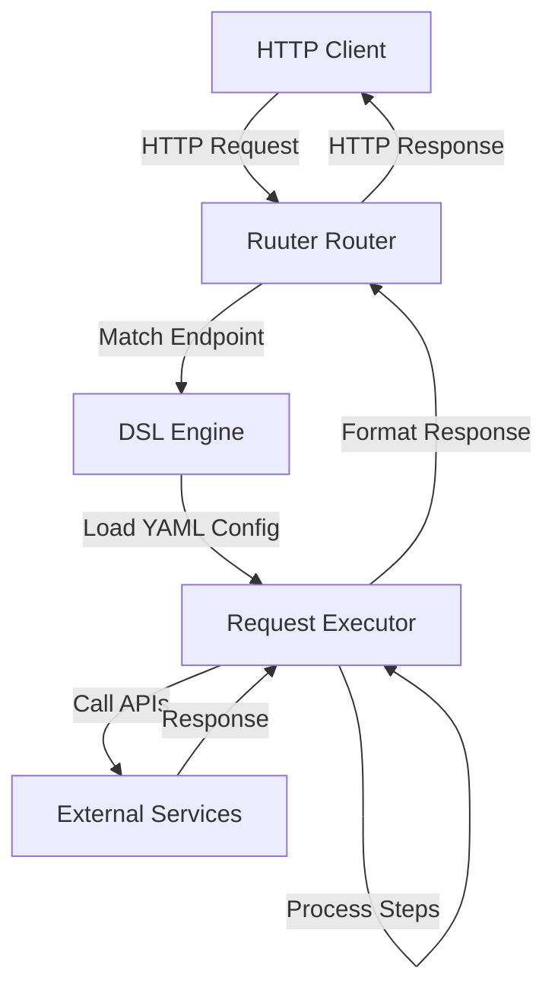
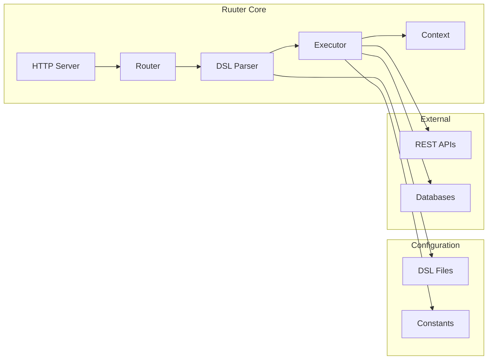

# Architecture Overview

## Introduction

Ruuter is a declarative REST routing engine that translates YAML DSL (Domain-Specific Language) files into executable REST endpoints. It follows a configuration-over-code approach, eliminating the need for traditional programming while maintaining flexibility and power.

## System Architecture



## Core Components

### 1. Router

The Router component handles incoming HTTP requests and maps them to DSL files based on:
- HTTP method (GET, POST, PUT, DELETE, etc.)
- URL path structure
- File system mapping convention

**Example**: `GET /iam/list` → `DSL/GET/iam/list.yml`

### 2. DSL Engine

The DSL Engine parses YAML configuration files and validates:
- Syntax correctness
- Required fields
- Data types and structures
- Step dependencies

### 3. Request Executor

The Request Executor processes each step defined in the DSL file sequentially or in parallel:
- Variable substitution
- HTTP calls to external services
- Data transformation
- Conditional logic
- Response formatting

### 4. Context Manager

Maintains request-scoped context including:
- Request parameters
- Headers
- Step results
- Temporary variables

## Design Principles

### Configuration as Code

All business logic is defined in YAML files, not in Java or other programming languages. This enables:
- Version control for business logic
- Non-developers to modify endpoint behavior
- Rapid prototyping and iteration

### Declarative Syntax

DSL files declare *what* should happen, not *how* it should happen:

```yaml
call:
  url: "http://api.example.com/users"
  method: GET
  headers:
    Authorization: "Bearer ${token}"
response:
  body: "${call.result}"
  status: 200
```

### Separation of Concerns

- **Routing**: Handled by file system structure
- **Business Logic**: Defined in DSL files
- **Service Integration**: Configured, not coded
- **Data Transformation**: Declarative mapping

## Component Diagram



## Request Lifecycle

1. **Request Reception**: HTTP server receives incoming request
2. **Endpoint Resolution**: Router matches URL to DSL file
3. **DSL Loading**: Parser loads and validates YAML configuration
4. **Context Initialization**: Request data stored in context
5. **Step Execution**: Executor processes each step sequentially
6. **Response Formation**: Result formatted according to DSL
7. **Response Delivery**: HTTP response sent to client

## Key Features

### Dynamic Routing

Endpoints are created simply by adding YAML files to the appropriate directory structure. No code changes or server restarts required.

### Request Chaining

Multiple service calls can be chained together, with results from one step feeding into the next:

```yaml
getUserId:
  call:
    url: "http://auth/user"

getProfile:
  call:
    url: "http://profile/${getUserId.result.id}"
```

### Error Handling

Configurable error handling with fallback strategies:

```yaml
call:
  url: "http://api/data"
  on_error: fallback

fallback:
  response:
    body: {"error": "Service unavailable"}
    status: 503
```

## Security Model

- Request validation at entry point
- Configurable authentication/authorization hooks
- No direct database access from DSL (through configured services only)
- Input sanitization

## Scalability

- Stateless design enables horizontal scaling
- Each request isolated in its own context
- No shared state between requests
- Can be deployed as multiple instances behind load balancer

## Technology Stack

- **Runtime**: Java 11+
- **Configuration**: YAML
- **HTTP Server**: Embedded server
- **Dependency Management**: Maven
- **Containerization**: Docker
